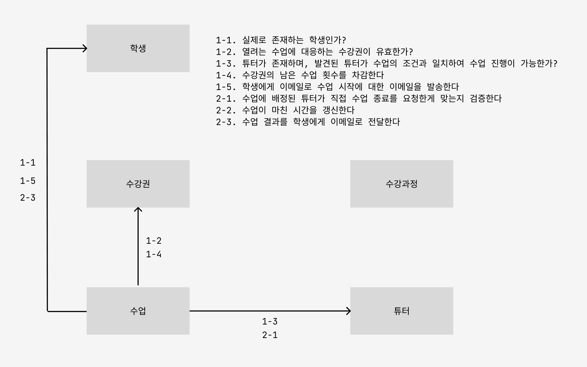
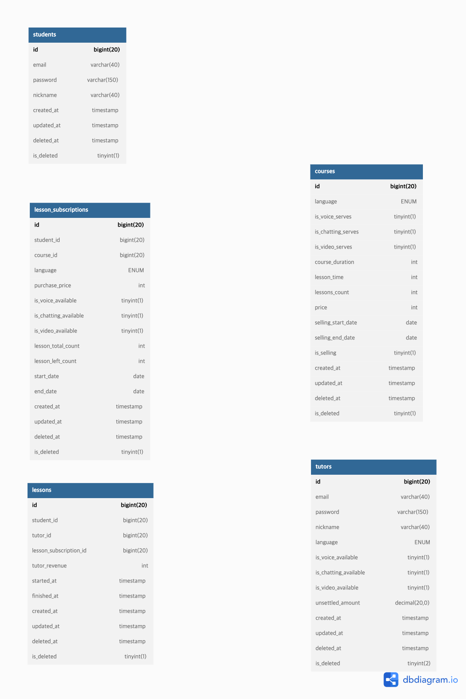

# 튜터링 사전과제
by 김도엽 (Doccimann)

## 실행 방법

~~~bash
# Docker build
docker build -t assignment-doccimann:latest .
# Docker run
docker run -p 8080:8080 assignment-doccimann:latest
~~~

## DDL 및 더미데이터 생성 코드

프로젝트의 루트 디렉토리 하에 **sql** 이라는 폴더가 존재하는데, 아래의 assignment.sql 파일에 DDL 및 더미데이터 생성 쿼리를 모두 저장해뒀습니다.

**assignment.sql** 파일에는 아래의 쿼리들이 존재합니다.

1. Table 생성문
2. Index 생성문
3. 더미데이터 insert문 

## 사용 도구 및 기술

### 언어
- Kotlin

### 프레임워크
- SpringBoot (Spring MVC)

### 데이터베이스
- MySQL

### ORM
- JPA (Java Persistence API), QueryDSL

### Test (Unit Test)
- MockK, kotest, JUnit5

### 배포도구
- Docker

## 설계 고려 사항

### 객체지도 (도메인 설계)

과제 요구사항 중에 커맨드 로직만을 따져서 객체간의 협력 관계를 따져서 다이어그램으로 그려보면 아래와 같습니다.

해당 객체 지도를 고려하여 작성한 ERD 다이어그램은 아래와 같습니다.

